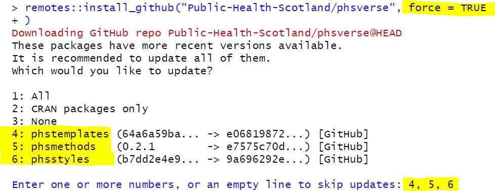

<!-- README.md is generated from README.Rmd. Please edit that file -->

# phsverse

<!-- badges: start -->

[](https://github.com/Public-Health-Scotland/phsverse/releases/latest)
[](https://github.com/Public-Health-Scotland/phsverse/actions/workflows/R-CMD-check.yaml)
[](https://app.codecov.io/gh/Public-Health-Scotland/phsverse?branch=master)
<!-- badges: end -->

This package is designed to make it easy to install and load multiple
packages developed in PHS in a single step. It is created with
[metamakr](https://github.com/jdtrat/metamakr) and combines our [Public
Health Scotland (PHS)](https://www.publichealthscotland.scot/) packages
on GitHub:

-   [phstemplates](https://github.com/Public-Health-Scotland/phstemplates)
-   [phsmethods](https://github.com/Public-Health-Scotland/phsmethods)
-   [phsstyles](https://github.com/Public-Health-Scotland/phsstyles)

## Installation

To install `phsverse`, the package `remotes` is required, and can be
installed with `install.packages("remotes")`.

You can then install `phsverse` on RStudio server from GitHub with:

``` r
remotes::install_github("Public-Health-Scotland/phsverse",
  force = TRUE
)
```

As `phsverse` is a meta package and rarely gets updated,
`install_github()` thinks there is nothing to be updated if there have
not been changes to the `phsverse` repository. However, there may have
been changes to its associated packages so `force = TRUE` is needed to
check for updates in the associated packages and install them if
necessary.

After running you may see the message “Which would you like to update?”
if there are updates of our PHS packages available. Please enter the
numbers of the PHS packages separated by a comma. Here is a screenshot
of how it looks like:



During the process of updating PHS packages it may ask you to update
other packages on CRAN. You can enter “3” representing “None” if you do
not wish to update other CRAN packages for now.

Network security settings may prevent `remotes::install_github()` from
working on RStudio desktop. If this is the case, you have to disconnect
VPN first and then use the same code as downloading from RStudio server.
Please note that unlike the other PHS GitHub packages, it can not be
installed by downloading the [zip of the
repository](https://github.com/Public-Health-Scotland/phsverse/archive/master.zip).

## Using phsverse

Load `phsverse` using `library()`:

``` r
library(phsverse)
#> ── Attaching packages ──────────────────────────────────────── phsverse 0.1.0 ──
#> ✔ phstemplates 1.1.1                      ✔ phsstyles    0.1.1.0.0.0.1654859281
#> ✔ phsmethods   1.0.0.0.0.0.1695807523
```
