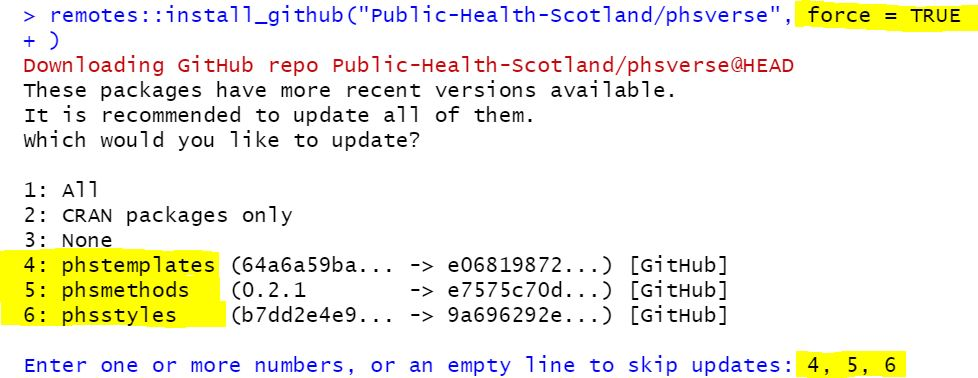

<!-- README.md is generated from README.Rmd. Please edit that file -->

# phsverse

<!-- badges: start -->

[](https://github.com/Public-Health-Scotland/phsverse/releases/latest)
[](https://github.com/Public-Health-Scotland/phsverse/actions/workflows/phs_package_checks.yaml)
[](https://app.codecov.io/gh/Public-Health-Scotland/phsverse?branch=master)

<!-- badges: end -->

phsverse makes it easy to install and load multiple R packages developed
by [Public Health Scotland
(PHS)](https://www.publichealthscotland.scot/) in a single step. It is a
meta-package created with
[metamakr](https://github.com/jdtrat/metamakr). Loading phsverse
attaches the main PHS R packages used across analytical workflows.

## Included packages

phsverse currently includes:

- [phsmethods](https://github.com/Public-Health-Scotland/phsmethods) -
  Commonly used methods and helper functions for PHS analysis.
- [phsstyles](https://github.com/Public-Health-Scotland/phsstyles) - PHS
  colours, themes and styling helpers.
- [phstemplates](https://github.com/Public-Health-Scotland/phstemplates) -
  Templates for PHS analytical outputs.

## Installation

### PHS users

PHS users can install the development version of phsverse from the PHS
Posit Package Manager:

``` r
install.packages("phsverse")
```

This is the default repository when working on PHS Posit Workbench.

### Development version

To install the development version, or for users who do not have access
to the PHS Posit Package Manager; install phsverse from GitHub:

``` r
remotes::install_github("Public-Health-Scotland/phsverse", force = TRUE)
```

If installing from GitHub, you may need to use force = TRUE to reinstall
the packages included in phsverse, even when the phsverse repository
itself has not changed. This is because phsverse is a meta-package and
is updated less frequently than the packages it installs and loads.

When installing from GitHub, you may see the prompt ‘Which would you
like to update?’ if updates are available. Select the PHS packages you
want to update. If you do not want to update other CRAN packages at the
same time, select None.



## Using phsverse

Load `phsverse` using `library()`:

``` r
library(phsverse)
#> ── Attaching packages ──────────────────────────────────────── phsverse 0.1.0 ──
#> ✔ phstemplates 1.3.0     ✔ phsstyles    0.2.0
#> ✔ phsmethods   1.1.0
```
